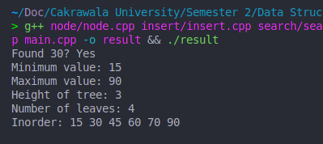

# Tugas OOP Binary Tree Sesi 9 

## Berikut adalah deskripsi tujuan, contoh input dan output, serta langkah algoritma untuk setiap fungsi dalam kode C++ yang telah saya buat:

**1. `Node::Node(int value)` (Konstruktor Node)**

* **Tujuan:** Membuat objek `Node` baru dengan nilai kunci (key) yang diberikan dan menginisialisasi pointer `left` dan `right` menjadi `nullptr`.
* **Contoh Input:** `int value = 50`
* **Contoh Output:** Objek `Node` baru dengan `key = 50`, `left = nullptr`, `right = nullptr`.
* **Langkah Algoritma:**
    1.  Menerima sebuah nilai integer sebagai `value`.
    2.  Mengatur anggota `key` dari objek `Node` yang baru dibuat menjadi `value`.
    3.  Mengatur pointer `left` dari objek `Node` menjadi `nullptr` (tidak menunjuk ke mana pun).
    4.  Mengatur pointer `right` dari objek `Node` menjadi `nullptr` (tidak menunjuk ke mana pun).

**2. `Node* insert(Node* root, int key)`**

* **Tujuan:** Memasukkan sebuah nilai `key` baru ke dalam Binary Search Tree (BST) yang berakar pada `root`. Jika `key` sudah ada, tidak ada perubahan yang terjadi.
* **Contoh Input:**
    * `root` = pointer ke akar BST (misalnya, bisa `nullptr` jika pohon kosong).
    * `key` = `30` (nilai yang akan dimasukkan).
* **Contoh Output:** Pointer ke akar BST yang mungkin telah berubah jika pohon sebelumnya kosong. Jika `root` awalnya menunjuk ke pohon `(50)`, setelah `insert(root, 30)`, pohon akan menjadi `(50 (30))` (secara sederhana).
* **Langkah Algoritma:**
    1.  **Jika pohon kosong (`root` adalah `nullptr`)**: Buat `Node` baru dengan nilai `key` dan jadikan node ini sebagai akar, lalu kembalikan pointer ke node baru tersebut.
    2.  **Jika pohon tidak kosong**:
        * **Jika `key` lebih kecil dari nilai kunci `root`**: Secara rekursif panggil fungsi `insert` pada subtree kiri (`root->left`) dengan nilai `key`. Hasil dari pemanggilan rekursif ini menjadi anak kiri baru dari `root`.
        * **Jika `key` lebih besar dari nilai kunci `root`**: Secara rekursif panggil fungsi `insert` pada subtree kanan (`root->right`) dengan nilai `key`. Hasil dari pemanggilan rekursif ini menjadi anak kanan baru dari `root`.
        * **Jika `key` sama dengan nilai kunci `root`**: Tidak melakukan apa pun (karena BST tidak biasanya menyimpan duplikat) dan kembalikan `root` yang tidak berubah.
    3.  Kembalikan pointer ke `root` (yang mungkin telah berubah jika node baru dimasukkan sebagai akar).

**3. `bool search(Node* root, int key)`**

* **Tujuan:** Mencari apakah sebuah nilai `key` terdapat dalam BST yang berakar pada `root`.
* **Contoh Input:**
    * `root` = pointer ke akar BST.
    * `key` = `30` (nilai yang dicari).
* **Contoh Output:** `true` jika `key` ditemukan dalam BST, `false` jika tidak.
* **Langkah Algoritma:**
    1.  **Jika pohon kosong (`root` adalah `nullptr`)**: Kembalikan `false` (nilai tidak mungkin ditemukan).
    2.  **Jika nilai kunci `root` sama dengan `key`**: Kembalikan `true` (nilai ditemukan).
    3.  **Jika `key` lebih kecil dari nilai kunci `root`**: Secara rekursif panggil fungsi `search` pada subtree kiri (`root->left`) dengan nilai `key`. Kembalikan hasil dari pemanggilan rekursif ini.
    4.  **Jika `key` lebih besar dari nilai kunci `root`**: Secara rekursif panggil fungsi `search` pada subtree kanan (`root->right`) dengan nilai `key`. Kembalikan hasil dari pemanggilan rekursif ini.

**4. `Node* findMin(Node* root)`**

* **Tujuan:** Menemukan node dengan nilai kunci terkecil dalam BST yang berakar pada `root`.
* **Contoh Input:** `root` = pointer ke akar BST (tidak boleh `nullptr` untuk BST yang tidak kosong).
* **Contoh Output:** Pointer ke node dengan nilai kunci minimum. Jika pohon kosong, mungkin mengembalikan `nullptr`.
* **Langkah Algoritma:**
    1.  **Jika pohon kosong (`root` adalah `nullptr`)**: Kembalikan `nullptr`.
    2.  **Selama node saat ini (`root`) memiliki anak kiri (`root->left` bukan `nullptr`)**: Pindahkan `root` ke anak kirinya (`root = root->left`). Nilai minimum dalam BST selalu berada di paling kiri.
    3.  Kembalikan pointer ke node saat ini (`root`), yang sekarang merupakan node dengan nilai kunci minimum.

**5. `Node* findMax(Node* root)`**

* **Tujuan:** Menemukan node dengan nilai kunci terbesar dalam BST yang berakar pada `root`.
* **Contoh Input:** `root` = pointer ke akar BST (tidak boleh `nullptr` untuk BST yang tidak kosong).
* **Contoh Output:** Pointer ke node dengan nilai kunci maksimum. Jika pohon kosong, mungkin mengembalikan `nullptr`.
* **Langkah Algoritma:**
    1.  **Jika pohon kosong (`root` adalah `nullptr`)**: Kembalikan `nullptr`.
    2.  **Selama node saat ini (`root`) memiliki anak kanan (`root->right` bukan `nullptr`)**: Pindahkan `root` ke anak kanannya (`root = root->right`). Nilai maksimum dalam BST selalu berada di paling kanan.
    3.  Kembalikan pointer ke node saat ini (`root`), yang sekarang merupakan node dengan nilai kunci maksimum.

**6. `Node* deleteNode(Node* root, int key)`**

* **Tujuan:** Menghapus node dengan nilai kunci `key` dari BST yang berakar pada `root`.
* **Contoh Input:**
    * `root` = pointer ke akar BST.
    * `key` = `30` (nilai yang akan dihapus).
* **Contoh Output:** Pointer ke akar BST yang mungkin telah berubah setelah penghapusan.
* **Langkah Algoritma:**
    1.  **Jika pohon kosong (`root` adalah `nullptr`)**: Kembalikan `nullptr`.
    2.  **Jika `key` lebih kecil dari nilai kunci `root`**: Secara rekursif panggil `deleteNode` pada subtree kiri (`root->left`) dengan nilai `key`. Hasilnya menjadi anak kiri baru dari `root`.
    3.  **Jika `key` lebih besar dari nilai kunci `root`**: Secara rekursif panggil `deleteNode` pada subtree kanan (`root->right`) dengan nilai `key`. Hasilnya menjadi anak kanan baru dari `root`.
    4.  **Jika `key` sama dengan nilai kunci `root` (node yang akan dihapus ditemukan)**:
        * **Jika node hanya memiliki satu anak atau tidak memiliki anak**: Ganti node yang akan dihapus dengan anaknya (atau `nullptr` jika tidak memiliki anak) dan hapus node yang asli. Kembalikan pointer ke anak (atau `nullptr`).
        * **Jika node memiliki dua anak**:
            * Cari node dengan nilai kunci terkecil di subtree kanan (inorder successor) menggunakan fungsi `findMin`.
            * Salin nilai kunci dari inorder successor ke node yang akan dihapus.
            * Hapus inorder successor dari subtree kanan (ini akan menjadi kasus penghapusan dengan nol atau satu anak).
    5.  Kembalikan pointer ke `root` (yang mungkin telah berubah).

**7. `void inorder(Node* root)`**

* **Tujuan:** Melakukan traversal inorder pada BST yang berakar pada `root` dan mencetak nilai kunci setiap node secara terurut menaik.
* **Contoh Input:** `root` = pointer ke akar BST.
* **Contoh Output:** Mencetak nilai-nilai kunci node ke konsol dalam urutan menaik, dipisahkan oleh spasi. Misalnya, untuk pohon `(50 (30) (70 (60) (90)))`, outputnya adalah: `30 50 60 70 90 `.
* **Langkah Algoritma:**
    1.  **Jika node saat ini (`root`) tidak kosong (`root` bukan `nullptr`)**:
        * Secara rekursif panggil fungsi `inorder` pada subtree kiri (`root->left`).
        * Cetak nilai kunci dari node saat ini (`root->key`).
        * Secara rekursif panggil fungsi `inorder` pada subtree kanan (`root->right`).

**8. `int height(Node* root)`**

* **Tujuan:** Menghitung ketinggian (jumlah maksimum tepi dari akar ke daun terjauh) dari BST yang berakar pada `root`. Ketinggian pohon kosong adalah 0, dan ketinggian pohon dengan satu node adalah 1 (atau 0 tergantung definisi). Dalam implementasi ini, ketinggian pohon kosong adalah 0.
* **Contoh Input:** `root` = pointer ke akar BST.
* **Contoh Output:** Integer yang menunjukkan ketinggian pohon. Untuk pohon `(50 (30) (70))`, ketinggiannya adalah 2. Untuk pohon kosong, ketinggiannya adalah 0.
* **Langkah Algoritma:**
    1.  **Jika pohon kosong (`root` adalah `nullptr`)**: Kembalikan `0`.
    2.  Secara rekursif hitung ketinggian subtree kiri (`leftHeight = height(root->left)`).
    3.  Secara rekursif hitung ketinggian subtree kanan (`rightHeight = height(root->right)`).
    4.  Kembalikan nilai maksimum antara `leftHeight` dan `rightHeight`, ditambah 1 (untuk menghitung tepi dari node saat ini ke subtree yang lebih tinggi).

**9. `int countLeaves(Node* root)`**

* **Tujuan:** Menghitung jumlah node daun (node yang tidak memiliki anak kiri maupun kanan) dalam BST yang berakar pada `root`.
* **Contoh Input:** `root` = pointer ke akar BST.
* **Contoh Output:** Integer yang menunjukkan jumlah node daun. Untuk pohon `(50 (30) (70 (60) (90)))`, node daunnya adalah `30`, `60`, dan `90`, jadi outputnya adalah `3`.
* **Langkah Algoritma:**
    1.  **Jika pohon kosong (`root` adalah `nullptr`)**: Kembalikan `0`.
    2.  **Jika node saat ini adalah daun (tidak memiliki anak kiri dan tidak memiliki anak kanan)**: Kembalikan `1`.
    3.  **Jika node bukan daun**: Secara rekursif hitung jumlah daun di subtree kiri (`countLeaves(root->left)`) dan jumlah daun di subtree kanan (`countLeaves(root->right)`). Kembalikan jumlah kedua nilai tersebut.


## Prerequisite

Untuk menjalankan kode ini, Anda memerlukan compiler C++ (GNU Compiler Collection - GCC) terinstal di sistem operasi Anda. Berikut adalah panduan untuk menginstalnya pada berbagai platform:

* **Windows:**
    * **MinGW (Minimalist GNU for Windows):**
        1.  Unduh installer dari situs web MinGW ([https://sourceforge.net/projects/mingw/files/Installer/](https://sourceforge.net/projects/mingw/files/Installer/)).
        2.  Jalankan installer dan ikuti petunjuk. Pastikan untuk memilih komponen `g++` (C++ Compiler) selama proses instalasi.
        3.  Setelah instalasi, tambahkan direktori `bin` dari instalasi MinGW (biasanya di `C:\MinGW\bin` atau serupa) ke **Environment Variables** sistem Anda agar perintah `g++` dapat dikenali dari Command Prompt atau PowerShell.
    * **MSYS2:**
        1.  Unduh installer dari situs web MSYS2 ([https://www.msys2.org/](https://www.msys2.org/)).
        2.  Jalankan installer dan ikuti petunjuk.
        3.  Buka MSYS2 MinGW 64-bit terminal (atau 32-bit sesuai instalasi) dan instal GCC dengan perintah:
            ```bash
            pacman -S mingw-w64-x86_64-gcc
            ```
            (Ganti `x86_64` dengan `i686` untuk versi 32-bit).
    * **WSL (Windows Subsystem for Linux):** Jika Anda menggunakan Windows 10 atau yang lebih baru, Anda dapat menginstal distribusi Linux (misalnya, Ubuntu) melalui Microsoft Store dan mengikuti petunjuk instalasi untuk Linux di bawah.

* **macOS:**
    * **Xcode Command Line Tools:**
        1.  Buka aplikasi **Terminal** (`/Applications/Utilities/`).
        2.  Jalankan perintah:
            ```bash
            xcode-select --install
            ```
            Ikuti petunjuk yang muncul untuk menginstal.
    * **Homebrew (opsional):** Jika Anda memiliki Homebrew terinstal ([https://brew.sh/](https://brew.sh/)), Anda dapat menginstal GCC dengan:
        ```bash
        brew install gcc
        ```

* **Linux:**
    * **Debian/Ubuntu:** Buka **Terminal** dan jalankan:
        ```bash
        sudo apt update
        sudo apt install g++
        ```
    * **Fedora/CentOS/RHEL:** Buka **Terminal** dan jalankan:
        ```bash
        sudo yum install gcc-c++
        # atau
        sudo dnf install gcc-c++
        ```
    * **Arch Linux:** Buka **Terminal** dan jalankan:
        ```bash
        sudo pacman -S gcc
        ```

## Cara Menjalankan Kode

Berikut adalah langkah-langkah untuk mengkompilasi dan menjalankan kode ini pada berbagai sistem operasi melalui command line:

1.  **Clone Repository (jika Anda belum melakukannya):**
    ```bash
    git clone https://github.com/titan2903/tugas-oop-sesi-9.git
    ```

2.  **Navigasi ke Direktori Proyek:**
    ```bash
    cd tugas-oop-sesi-9
    ```

3.  **Kompilasi Kode:** Gunakan perintah `g++` untuk mengkompilasi semua file sumber. Pastikan Anda berada di direktori `tugas-oop-sesi-9` saat menjalankan perintah ini:

    ```bash
    g++ node/node.cpp insert/insert.cpp search/search_node.cpp find_min/find_min.cpp find_max/find_max.cpp delete/delete.cpp inorder/inorder.cpp height/height.cpp count_leaves/count_leaves.cpp main.cpp -o result
    ```

    Perintah ini akan menghasilkan file executable bernama `result`.

4.  **Jalankan Program:**

    * **Windows (Command Prompt):**
        ```bash
        .\result.exe
        ```
    * **Windows (PowerShell):**
        ```bash
        .\result.exe
        ```
    * **macOS:**
        ```bash
        ./result
        ```
    * **Linux:**
        ```bash
        ./result
        ```

    Program akan menjalankan serangkaian operasi Binary Search Tree dan mencetak hasilnya ke konsol.

## Ouput

Berikut output atau hasil dari kode yang telah dijalankan seperti pada gambar dibawah ini:


### Catatan:

* Pastikan semua file `.cpp` dan `.h` berada dalam struktur direktori yang sesuai.
* Jika Anda mengalami masalah saat menjalankan perintah `g++`, pastikan compiler C++ telah terinstal dengan benar dan dapat diakses dari command line Anda. Anda mungkin perlu me-restart terminal atau command prompt setelah menginstal compiler atau memperbarui environment variables.
* Jika Anda menggunakan Integrated Development Environment (IDE) seperti Visual Studio Code, CLion, atau Code::Blocks, Anda biasanya dapat mengkonfigurasi proyek dan menjalankan kode langsung dari IDE tanpa menggunakan command line secara manual.